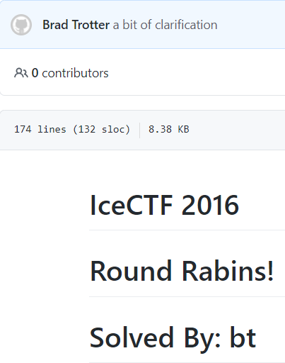

Rabid Rabin
===========

## Challenge info:

We intercepted this message. It kind of looked like RSA at first, but there's no exponent in the public key...

## Solution:

The name of the challenge suggested use of the [Rabin cryptosystem](https://en.wikipedia.org/wiki/Rabin_cryptosystem), which the lack of an exponent confirmed; converting the modulus to base-10 and [checking if someone online had previously factored it](http://www.factordb.com/index.php?query=64703986196590532550677581867968606868573389071252692910980134129544137251401009133960328088692271842214498048655106618080254509684622363068406743573918979874641476333101257493419006081088753833559346504226066744706781644205324359031963711461737816475092631177676839385116576945754784715871099567521310291121) revealed the modulus was a perfect square.
This complicated decryption efforts, as the traditional Rabin decryption process requires finding two integers to multiply the primes by to get 1; obviously there will be no way to multiply an integer a whole number times itself and obtain 1 unless the integer is 1, so additional research was required.
Searching for CTF writeups of this challenge [struck gold](https://github.com/WCSC/writeups/blob/master/icectf-2016/Round-Rabins/README.md), but something about this writeup seems a bit familiar...




Anyway, the writeup explained that solving this challenge required using the [Tonelli-Shanks algorithm](https://en.wikipedia.org/wiki/Tonelli%E2%80%93Shanks_algorithm) to find the value of the square root of the ciphertext mod the prime, followed by using [Hensel's Lemma](https://en.wikipedia.org/wiki/Hensel%27s_lemma) to "lift" the value of the previous step to its corresponding value modulus the square of the prime, recovering the original message which was the flag.

The writeup had a working Python 2 solution, a bit of updating and inserting the current challenge values yielded the flag:

```
$ ./rabid_rabin.py
Equifax{oops_used_a_square_of_a_prime_for_my_modulus_in_the_rabin_cryptosystem_86621dd}
```